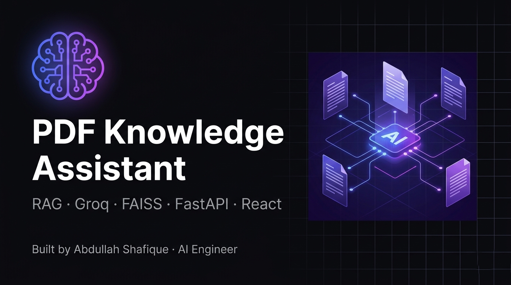
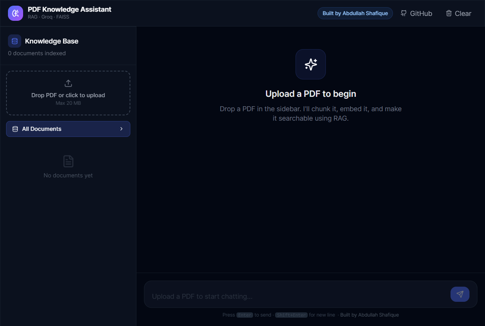
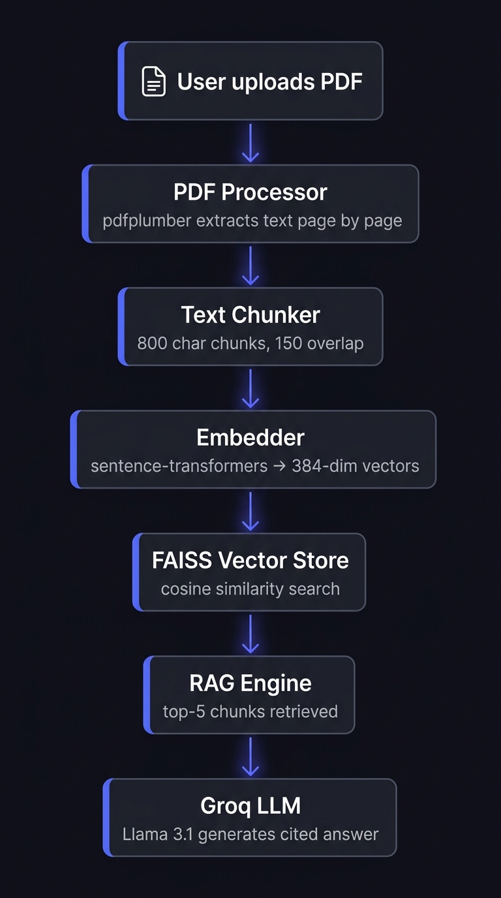

# 🧠 PDF Knowledge Assistant

> RAG-powered document intelligence — upload any PDF and chat with it using natural language. The system retrieves the most relevant sections and generates accurate, source-cited answers in seconds.

**Built by [Abdullah Shafique](https://www.linkedin.com/in/aadi-abdullah)**  
AI Engineer · FastAPI · Groq · React

[](https://pdf-knowledge-assistant.vercel.app)
&nbsp;
[](https://github.com/aadi-abdullah)
&nbsp;
[](https://www.linkedin.com/in/aadi-abdullah)

---

## Overview

Most document tools make you search. This one makes you ask.

The PDF Knowledge Assistant lets you upload any PDF — a research paper, legal contract, company report, or policy document — and ask questions in plain English. It retrieves the most relevant sections using vector similarity search, feeds them to an LLM with full context, and returns a grounded, accurate answer with page-level citations.

No ctrl+F. No manual skimming. Just a question and an answer.

---

## Demo



**Try it live →** [pdf-knowledge-assistant.vercel.app](https://pdf-knowledge-assistant.vercel.app)

---

## How It Works



```
User uploads PDF
      │
      ▼
[PDF Processor]   ──  pdfplumber extracts text page by page
      │
      ▼
[Chunker]         ──  Text split into overlapping chunks (800 chars, 150 overlap)
      │
      ▼
[Embedder]        ──  sentence-transformers converts chunks to 384-dim vectors
      │
      ▼
[FAISS Store]     ──  Vectors indexed locally for cosine similarity search
      │
      ▼
[RAG Engine]      ──  User query embedded → top-5 chunks retrieved
      │
      ▼
[Groq LLM]        ──  Llama 3.1 generates grounded answer from context
      │
      ▼
[React Frontend]  ──  Answer displayed with source citations + page numbers
```

---

## Features

- **Conversational document search** — ask questions in plain English, get cited answers
- **Source citations** — every answer shows which page and section it came from, with a relevance score
- **Multi-document support** — upload multiple PDFs and search across all or filter by one
- **Multi-turn memory** — rolling conversation history for follow-up questions
- **Local vector store** — FAISS runs entirely on-device, no cloud database needed
- **Fast inference** — Groq's Llama 3.1 8B delivers answers in under 3 seconds
- **Clean dark UI** — built with React, Vite, and Tailwind CSS

---

## Tech Stack

| Layer | Technology |
|---|---|
| Frontend | React 18, Vite, Tailwind CSS |
| Backend | FastAPI, Python 3.11 |
| LLM | Groq — `llama-3.1-8b-instant` |
| Embeddings | `sentence-transformers/all-MiniLM-L6-v2` |
| Vector Store | FAISS (local, no cloud needed) |
| PDF Parsing | pdfplumber |
| Backend Deploy | Hugging Face Spaces (Docker) |
| Frontend Deploy | Vercel |

---

## Project Structure

```
pdf-knowledge-assistant/
│
├── backend/
│   ├── app/
│   │   ├── main.py                # FastAPI app + CORS + startup
│   │   ├── config.py              # Pydantic settings from .env
│   │   ├── models.py              # Request / response schemas
│   │   ├── routers/
│   │   │   ├── documents.py       # Upload / list / delete PDFs
│   │   │   └── chat.py            # RAG Q&A endpoint
│   │   └── services/
│   │       ├── pdf_processor.py   # Extract + chunk PDFs
│   │       ├── embeddings.py      # sentence-transformers (free, local)
│   │       ├── vector_store.py    # FAISS upsert + similarity search
│   │       └── rag_engine.py      # Retrieval + Groq generation
│   ├── requirements.txt
│   ├── Dockerfile
│   └── .env.example
│
├── frontend/
│   ├── src/
│   │   ├── components/
│   │   │   ├── Header.jsx          # Top bar + branding
│   │   │   ├── Sidebar.jsx         # Document upload + management
│   │   │   ├── ChatWindow.jsx      # Message list + empty state
│   │   │   ├── ChatMessage.jsx     # Markdown rendering + sources
│   │   │   ├── ChatInput.jsx       # Auto-grow textarea
│   │   │   └── SourceCard.jsx      # Expandable source citations
│   │   ├── hooks/
│   │   │   ├── useDocuments.js     # Upload / delete state
│   │   │   └── useChat.js          # Chat history + RAG calls
│   │   ├── api.js                  # Axios API client
│   │   └── App.jsx
│   └── package.json
│
└── assets/
    ├── banner.png
    ├── demo.png
    └── architecture.png
```

---

## Local Setup

### Prerequisites
- Python 3.11+
- Node.js 20+
- Free API key from [Groq](https://console.groq.com)

### Installation

```bash
# 1. Clone the repo
git clone https://github.com/aadi-abdullah/pdf-knowledge-assistant.git
cd pdf-knowledge-assistant

# 2. Backend setup
cd backend
python -m venv venv
venv\Scripts\activate        # Windows
source venv/bin/activate     # Mac / Linux
pip install -r requirements.txt

# 3. Create .env file
cp .env.example .env
# Add your GROQ_API_KEY inside .env

# 4. Frontend setup
cd ../frontend
npm install
```

```env
# .env
GROQ_API_KEY=gsk_...
GROQ_MODEL=llama-3.1-8b-instant
EMBEDDING_MODEL=all-MiniLM-L6-v2
EMBEDDING_DIMENSION=384
CHUNK_SIZE=800
CHUNK_OVERLAP=150
TOP_K_RESULTS=5
```

```bash
# 5. Run backend (Terminal 1)
cd backend && uvicorn app.main:app --reload

# 6. Run frontend (Terminal 2)
cd frontend && npm run dev
```

Open **http://localhost:5173**

---

## API Reference

| Method | Endpoint | Description |
|---|---|---|
| `POST` | `/api/v1/documents/upload` | Upload and index a PDF |
| `GET` | `/api/v1/documents/` | List all indexed documents |
| `DELETE` | `/api/v1/documents/{doc_id}` | Remove a document |
| `POST` | `/api/v1/chat/` | Ask a question (RAG) |
| `GET` | `/api/v1/chat/health` | Health check |

Interactive docs at **http://localhost:8000/docs**

---

## Configuration

| Variable | Description | Default |
|---|---|---|
| `GROQ_API_KEY` | Groq API key | — |
| `GROQ_MODEL` | LLM model name | `llama-3.1-8b-instant` |
| `EMBEDDING_MODEL` | Embedding model | `all-MiniLM-L6-v2` |
| `EMBEDDING_DIMENSION` | Vector dimensions | `384` |
| `CHUNK_SIZE` | Chars per chunk | `800` |
| `CHUNK_OVERLAP` | Overlap between chunks | `150` |
| `TOP_K_RESULTS` | Chunks retrieved per query | `5` |

---

## Get Free API Keys

| Service | Free Tier | Link |
|---|---|---|
| Groq | Generous daily limits | [console.groq.com](https://console.groq.com) |

---

## Roadmap

- [ ] Streaming responses (SSE)
- [ ] Persistent document registry (PostgreSQL)
- [ ] Authentication (JWT)
- [ ] Re-ranking with cross-encoders
- [ ] Hybrid search (BM25 + vector)

---

## About the Author

I'm an AI Engineer with a background in design — I spent 6 years as a professional graphic designer before transitioning into software engineering. That background shapes how I build: I optimise for systems that are both technically sound and genuinely usable.

- 🎓 Software Engineering — Riphah International University (GPA 3.99 / 4.0, 2024–2028)
- 🏅 AI Agent Developer Specialization — Vanderbilt University
- 🏅 Microsoft Python Development Specialization
- 🏅 Adobe Graphic Designer Specialization

**Currently open to AI engineering internships and junior roles.**

→ [LinkedIn](https://www.linkedin.com/in/aadi-abdullah) · [GitHub](https://github.com/aadi-abdullah) · abdullahshafique2019@gmail.com

---

## License

MIT — free to use, modify, and distribute.
